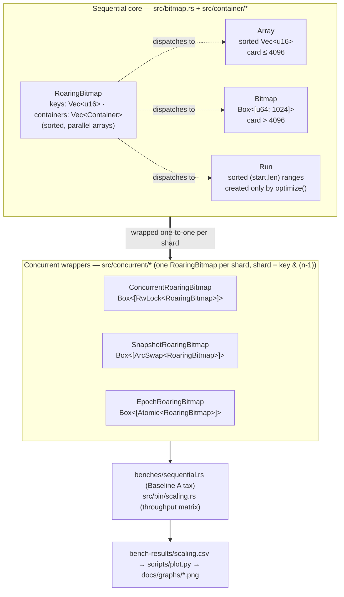
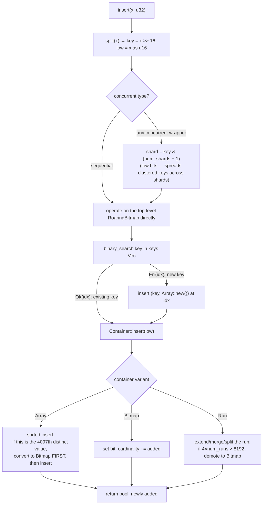
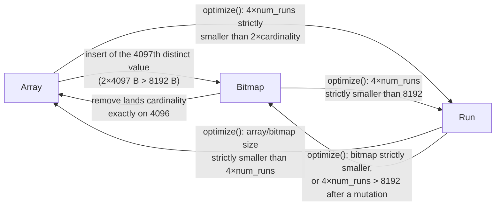
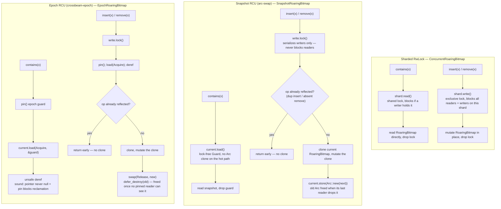
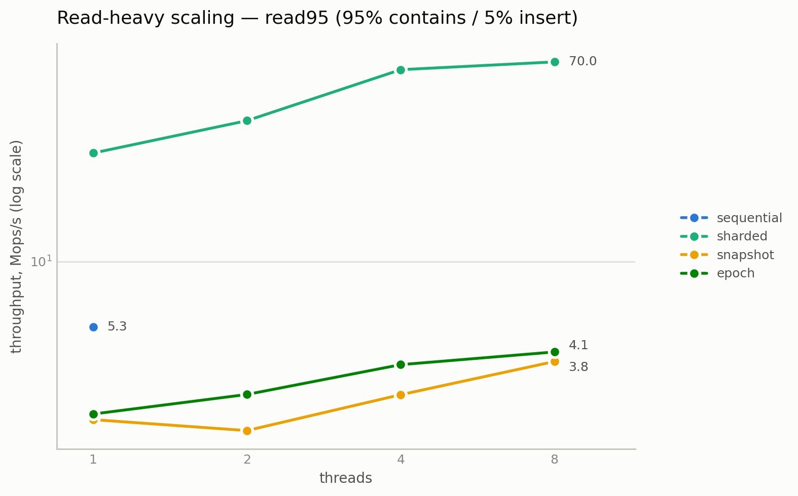
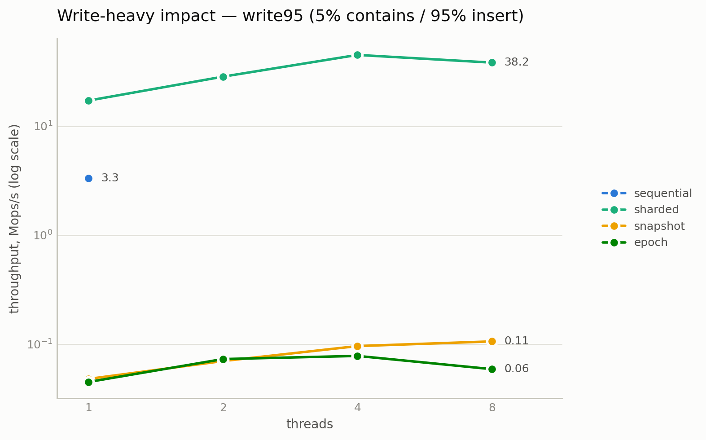

# concurrent_roaring

## Overview

A concurrent [Roaring bitmap](https://roaringbitmap.org/) for `u32` values in Rust — a compressed
integer set supporting `insert` / `remove` / `contains` / `len` / `optimize` / `and` / `or` — built
to answer one question with measurements instead of intuition: **what does concurrency actually
cost?** The crate contains one sequential implementation and three concurrent ones (sharded
`RwLock`, RCU via `arc-swap`, RCU via `crossbeam-epoch`), all benchmarked against explicit
baselines on identical, deterministically seeded workloads, with the tradeoffs written up honestly
— including the goals that were missed and why.

## Design

**Container model.** A `u32` splits into a 16-bit *key* (high half) and a 16-bit *low* half. Values
sharing a key live in one `Container`, an enum of three representations:

- `Array` — sorted `Vec<u16>`, cardinality ≤ 4096 (2 bytes/value),
- `Bitmap` — `Box<[u64; 1024]>`, a fixed 8 KiB bit-set for cardinality > 4096,
- `Run` — sorted, non-overlapping, non-adjacent `(start, len)` runs (4 bytes/run).

Conversion thresholds: an array converts to a bitmap *before* accepting its 4097th distinct value
(4096 × 2 B = 8192 B — the exact break-even point); a bitmap converts back when a remove lands
cardinality exactly on 4096; a run list demotes to a bitmap when `4 × num_runs > 8192`. Runs are
created only by `optimize()`, which applies CRoaring's smallest-of-three heuristic: compute the
byte size of each valid representation and convert only if the smallest is *strictly* smaller than
the current one. The enum (not a trait object) keeps conversion a plain reassignment and dispatch a
jump table. The top level is a pair of parallel vectors (`keys: Vec<u16>`,
`containers: Vec<Container>`) sorted by key, so the hot key search strides 2-byte entries.

**Shard scheme (shared by all three concurrent types).** A power-of-two shard count (default 64);
shard index is `key & (num_shards − 1)` — *low* key bits, so clustered real-world data round-robins
across shards instead of piling into one. Each shard holds a whole sequential `RoaringBitmap` that
simply sees only its subset of keys, and each shard is padded to a 128-byte cache line so one
shard's lock traffic cannot false-share a neighbor's.

**The three concurrency strategies:**

| Type | Reads | Writes | Reclamation |
|---|---|---|---|
| `ConcurrentRoaringBitmap` | per-shard `RwLock` read | per-shard `RwLock` write | n/a |
| `SnapshotRoaringBitmap` | lock-free `ArcSwap` load | per-shard mutex + clone-and-swap (RCU) | `Arc` refcount (eager) |
| `EpochRoaringBitmap` | lock-free atomic load under an epoch pin | per-shard mutex + clone-and-swap (RCU) | `crossbeam-epoch` deferred GC |

The two RCU types share one pattern: readers load an immutable snapshot pointer with no lock and no
shared write; writers serialize on a per-shard mutex, clone the current snapshot, mutate the clone,
and publish it atomically (Release store paired with the readers' Acquire load). The clone-per-write
cost is the deliberate, measured tradeoff — these are read-optimized structures.

### Architecture diagrams

**How the pieces fit together.** One sequential `RoaringBitmap` implementation is reused, unmodified,
as the payload of every shard in all three concurrent wrappers — only the synchronization technique
wrapped around it differs.

**Operation flow** — `insert(x)` traced from the public API down to the container mutation
(`remove`/`contains` follow the same routing, swapping the lock mode and terminal call):

**Container conversion state machine** — every transition is driven by a size comparison, never an
arbitrary rule; `optimize()` is the *only* path that ever creates a `Run`:

**Concurrency techniques — read and write path per structure.** All three share the
shard-per-`RoaringBitmap` layout above; this is what differs inside `shard(key)`:

Reading the three side by side: the **lock word itself** is the difference. An `RwLock` read acquire
still writes a reader-count word (a shared cache line every reader touches), `ArcSwap::load` reads a
pointer with no writable side effect, and the epoch guard is a thread-local pin with no shared write
at all — which is exactly the tax ordering measured in [Results](#results) (−19.3% / −13.2% / −11.4%).

## The degradation question

"Concurrent without performance degradation" is meaningless until you say *degradation relative to
what*. This project pins two baselines and never conflates them:

- **Baseline A — the concurrency tax.** Run each concurrent structure **single-threaded** against
  our own sequential `RoaringBitmap` on identical workloads. This isolates what the concurrency
  machinery (locks, atomic loads, epoch pins, clones) costs when there is no contention at all.
- **Baseline B — the absolute reference.** Run our sequential `RoaringBitmap` against the published
  [`roaring`](https://crates.io/crates/roaring) crate. A tiny tax over a slow sequential
  implementation proves nothing; this check keeps the yardstick honest.

A concurrent variant is never compared directly against the `roaring` crate as its primary claim —
that would muddy which of the two questions is being answered. Numeric goals: **T1** — tax within
10%; **T2** — read-heavy throughput monotonic to 8 threads and ≥4× its own 1-thread number;
**T3** — sequential implementation within explainable distance (≤2× on every benchmark) of the
`roaring` crate.

## Methodology

- **Machine:** Apple M5 · 10 physical / 10 logical cores (heterogeneous: ~4 performance cores) ·
  24 GiB · macOS 26.5.1 (arm64) · rustc 1.97.0 · release profile with `lto = "fat"`,
  `codegen-units = 1`.
- **Datasets** (deterministic, pinned seeds, generated by `src/bitmap.rs::datasets`):
  *dense* = `0..1_000_000` contiguous; *sparse* = 1 M uniform-random `u32` (seed `0xDEAD_BEEF`);
  *clustered* = 1,000 random bases × 1,000 consecutive values each (seed `0x00C0_FFEE`); *probes* =
  500 K hits + 500 K uniform misses, shuffled (seed `0xFEED_BEEF`).
- **Sequential benchmarks:** criterion 0.5, ours and the `roaring` crate side by side on identical
  inputs — build, contains, remove, and/or across the dataset matrix.
- **Scaling harness** (`src/bin/scaling.rs`): pre-populate with the clustered dataset; workloads
  read95 (95% contains / 5% insert), mixed50, write95; threads {1, 2, 4, 8} (16 requested, clamped
  to the box); per-thread seeded RNGs (`0x5CA1_AB1E ^ thread_index`); all threads released by a
  barrier, 2 M ops each; throughput = total ops / wall time. Results in `bench-results/scaling.csv`.
- **Correctness:** every operation is differentially tested against the `roaring` crate under
  proptest (random op streams, every return value compared), plus invariant checks and two
  concurrent stress patterns (a disjoint-partition lost-update detector and a contended
  reader/writer smoke) run against all three concurrent types in release mode.

## Results

**Baseline A — the tax** (single-threaded, vs our sequential; negative = faster than sequential.
Same-run sequential references: build/clustered 10.241 ms, contains/clustered 17.264 ms):

| Structure | build overhead | contains overhead |
|---|---|---|
| sharded | **−24.0%** | **−19.3%** |
| snapshot | +5058% (≈51.6×) | **−13.2%** |
| epoch | +5115% (≈52.1×) | **−11.4%** |

**Scaling** (Mops/s; sequential 1-thread reference: read95 5.30, write95 3.32):

| read95 | 1t | 2t | 4t | 8t | 8t/1t |
|---|---|---|---|---|---|
| sharded | 28.78 | 39.46 | 64.88 | 69.99 | 2.43× |
| snapshot | 2.14 | 1.93 | 2.73 | 3.77 | 1.76× |
| epoch | 2.26 | 2.74 | 3.66 | 4.14 | 1.83× |

| write95 | 1t | 2t | 4t | 8t |
|---|---|---|---|---|
| sharded | 17.14 | 28.39 | 44.94 | 38.21 |
| snapshot | 0.048 | 0.070 | 0.096 | 0.106 |
| epoch | 0.045 | 0.073 | 0.078 | 0.059 |

**Baseline B — ours vs the `roaring` crate** (ratio = ours ÷ reference; <1 means ours is faster):
build 0.61×/1.02×/0.64× (dense/sparse/clustered), contains 0.94×/0.54×/0.67×, remove 0.96×,
and/or between 0.004× and 0.98×. The dramatic set-operation wins are structural, not artifacts:
our operands are `optimize()`d into run containers, and `roaring` 0.10 has no run containers, so
`clustered ∩ clustered` on our side is a two-pointer walk over a handful of runs.

**Verdicts:**

- **T1 (tax ≤ 10%): met on the read path by all three structures** — every concurrent type is
  *faster* than the sequential map single-threaded, because 64-way sharding also partitions the
  data: each shard's key vector is ~1/64 the length, so binary searches are shorter and new-key
  inserts shift far less memory. The ordering between the three (−19.3% / −13.2% / −11.4%) is the
  read machinery's cost showing through: an uncontended `parking_lot` read acquire < an `ArcSwap`
  guard load < an epoch pin. **Intentionally missed on the RCU write path** (≈52× on build):
  clone-per-write is the read-optimized design being measured, not a regression — and both
  reclamation schemes price it identically (528 vs 534 ms), because the clone dominates.
- **T2 (read95 monotonic to 8t, ≥4× own 1t): missed by all three.** Best self-relative ratio is
  sharded at 2.43×; sharded and epoch are both monotonic through 8 threads (2.43×/1.83×), while
  snapshot dips at 2 threads. Causes: the M5's ~4 performance cores knee every curve at 4 threads
  (added threads land on efficiency cores), and the RCU types serialize on per-shard clones
  because every workload in the matrix contains writes.
- **T3 (≤2× of `roaring` everywhere): met with margin** — worst unfavorable ratio is 1.02×
  (`build/sparse`), statistical parity, after an optimization pass (structure-of-arrays key
  layout, cache-line-padded shards, fat LTO) documented in `commit.md`.

## Tradeoff analysis

**Sharded `RwLock` — wins almost everywhere; that is the honest headline.** It has negative tax,
the highest absolute throughput in every measured cell (69.99 vs 4.14 Mops at read95/8t), and
write throughput three orders of magnitude above the RCU types. Its weakness is structural, not
visible in these numbers: even a *reader* performs an atomic read-modify-write on the shard's lock
word, so readers on the same shard bounce a cache line, and a writer stalls all readers on its
shard for the duration of the write. With 64 shards and only 5% writes that cost is small — the
curves flatten past 4 threads mostly because of core topology — but it grows with write rate,
reader concurrency per shard, and write-hold time.

**Snapshot (`arc-swap`) — pays a fixed toll per read, removes reader/writer interference.** Reads
touch no lock and never block, so a reader can never be stalled by a writer (predictable read
latency — the property the `RwLock` cannot offer). The price: every write clones an entire shard
(~52× single-threaded build cost), and even the read path's `ArcSwap` guard load costs ~6 pp more
tax than a bare lock acquire. Eager `Arc` reclamation is its quiet advantage under write churn:
each retired snapshot is freed immediately by whoever drops the last reference, so memory and
latency stay steady — snapshot keeps improving through 8 threads on write95 (0.096 → 0.106 Mops)
where epoch regresses.

**Epoch (`crossbeam-epoch`) — the best pure-read scaler, the worst under write churn.** Its read95
curve is monotonic through 8 threads and keeps growing where sharded's 4t→8t step nearly flattens
(+7.9%), because its read path is a pin + `Acquire` load with no shared-cache-line write at all —
architecturally the cleanest read path of the three. But
deferred reclamation cuts both ways: with many threads pinning constantly, epoch advancement lags,
retired O(shard) snapshots accumulate, and their destruction lands in bursts on worker threads —
write95 *drops* from 0.078 to 0.059 Mops between 4 and 8 threads while `Arc`'s eager frees keep
snapshot inching up. The reclamation scheme's payoff is confined to the read path.

**Rule of thumb from the data:** under any workload with a nontrivial write fraction, sharding
plus a fast `RwLock` is simply the right call at this scale. The RCU designs make sense only when
reads must never block (tail-latency guarantees) or the write fraction is near zero — and between
them, choose epoch for read scaling, snapshot for predictable behavior under writes.

## Limitations

- **Cross-shard operations are per-shard-atomic, not linearizable.** `len`, `is_empty`,
  `snapshot`, `and`, `or` visit shards one at a time; a concurrent writer can land between visits,
  so the result is a state the bitmap may never have occupied at any single instant.
- **Clone-per-write is O(shard size).** Under write-heavy load the RCU types collapse (~0.05–0.11
  Mops vs sharded's ~38); higher shard counts shrink the cloned unit but the asymptotics stand.
- **No serialization and no iterators** — deliberately out of scope; membership queries and set
  algebra are the interface.
- **Single-machine benchmarks.** All numbers come from one Apple M5 with a heterogeneous 4 P-core
  topology that caps every scaling curve at 4 threads; absolute numbers and knees will differ on
  server parts.

## Future work

- **Run-aware kernels everywhere:** several `and`/`or` paths expand runs instead of operating on
  them natively; the clustered-workload wins suggest more is available.
- **Adaptive or higher shard counts:** `with_shard_count(256)` would shrink each RCU clone ~4× and
  should lift write-heavy RCU numbers roughly proportionally — worth measuring, not assuming.
- **True CAS-based container mutation:** replacing clone-the-shard with per-container
  copy-on-write (or CAS on container pointers) would shrink the RCU write unit from a shard to a
  container, attacking the ~52× write tax directly.
- **A pure-read benchmark column (0% writes)** — the regime where the lock-free read paths should
  overtake the `RwLock`, absent from the current matrix and the natural next measurement.
